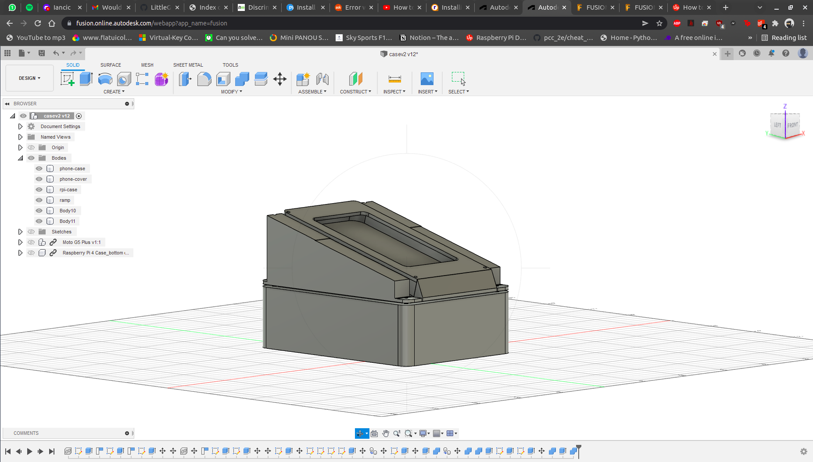
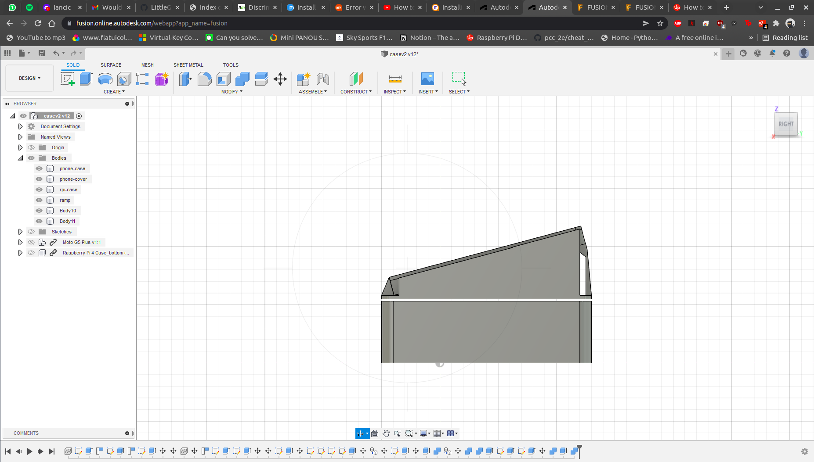
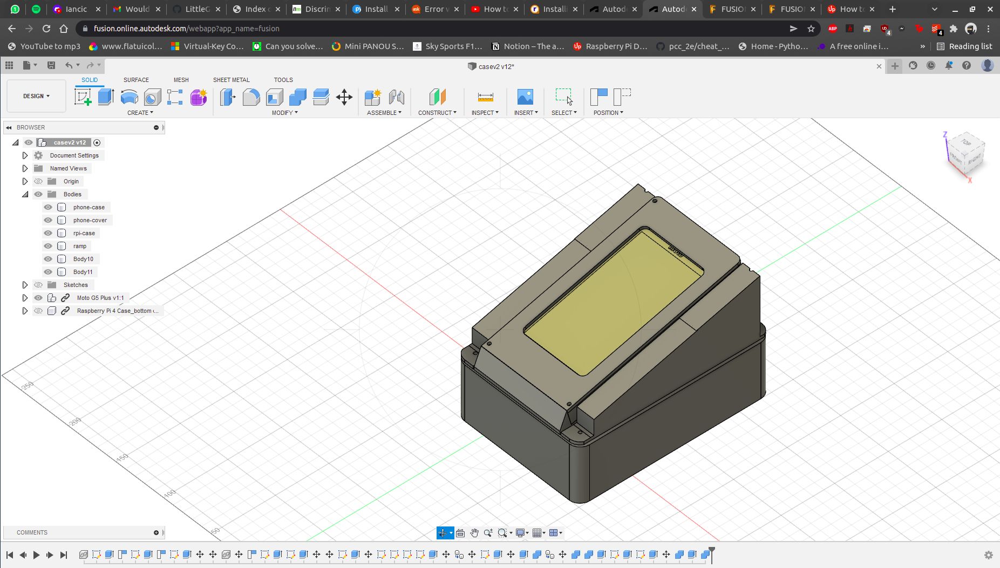
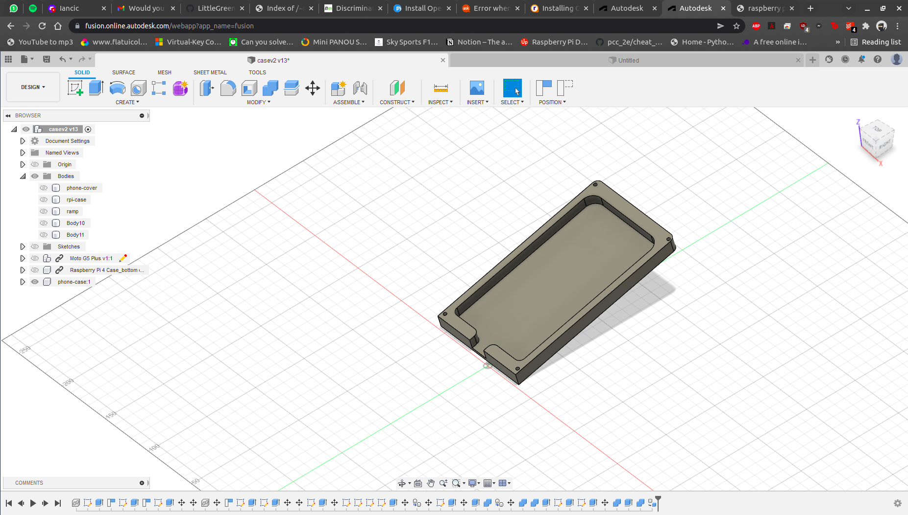
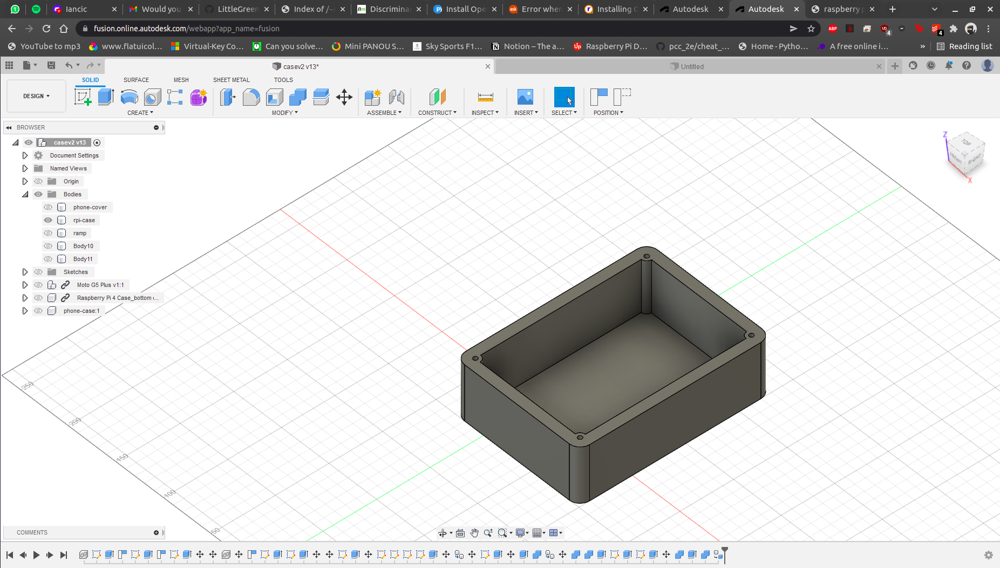
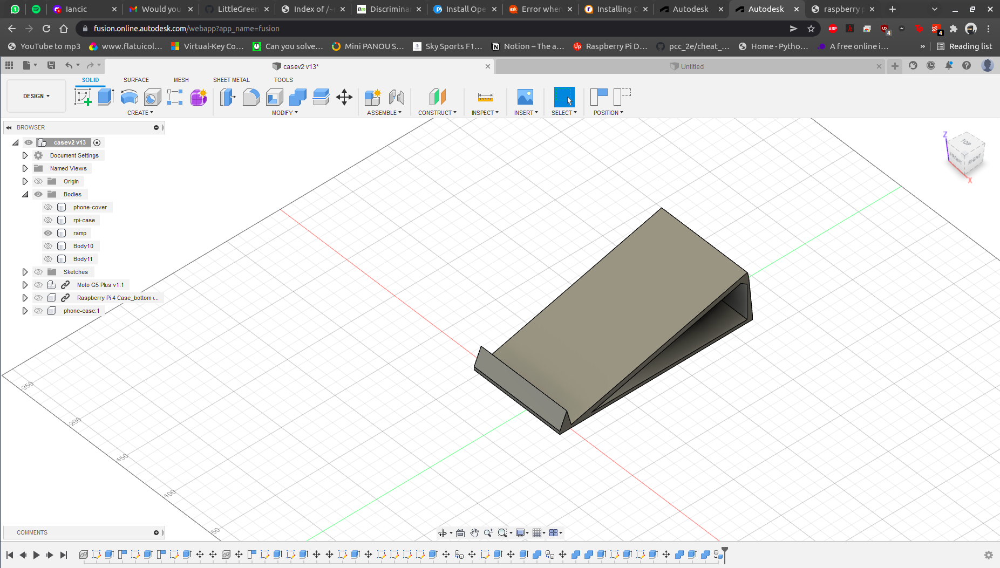
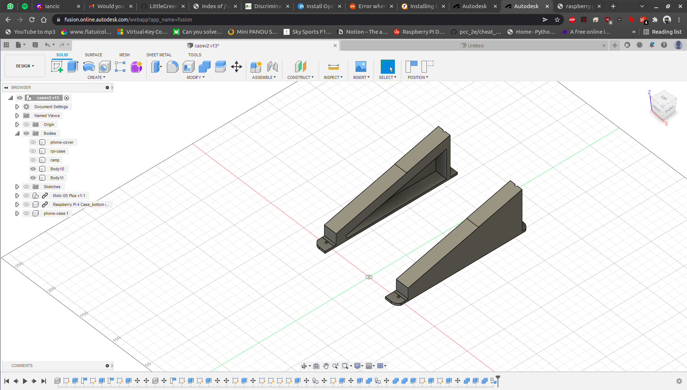
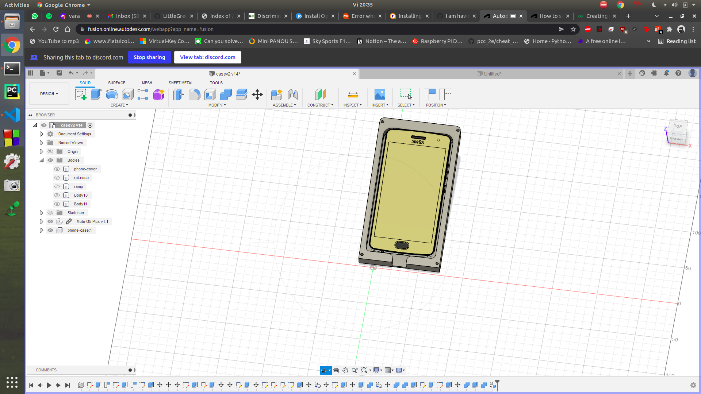

# 3D Models 

For our hardware part of the project, we decided to 3D model some parts. Those parts were 3D printed and assembled for out eBon device.

Here are some pictures of our 3D models:

