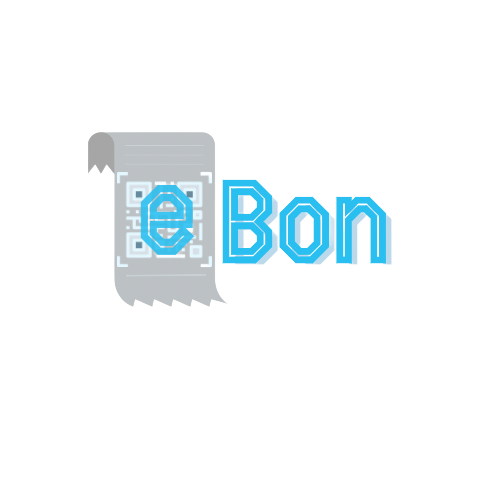
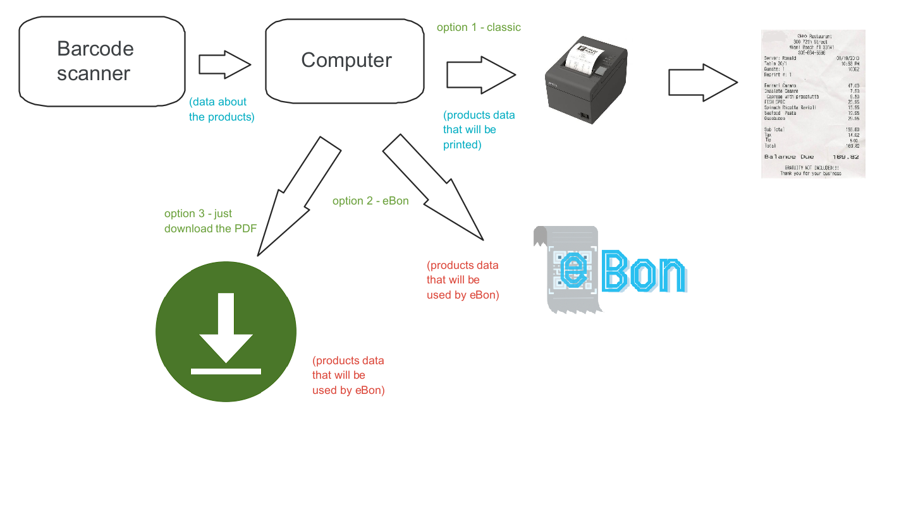
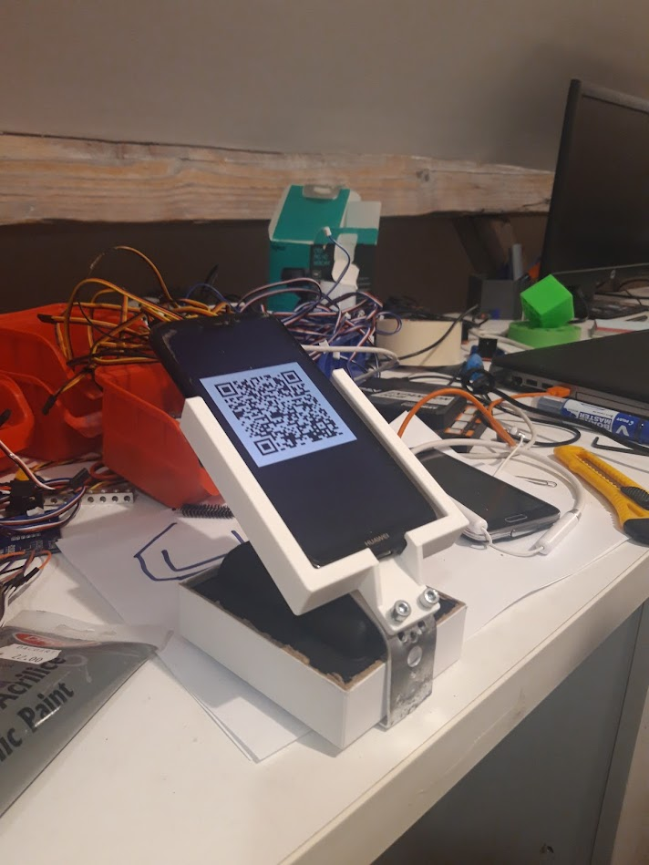
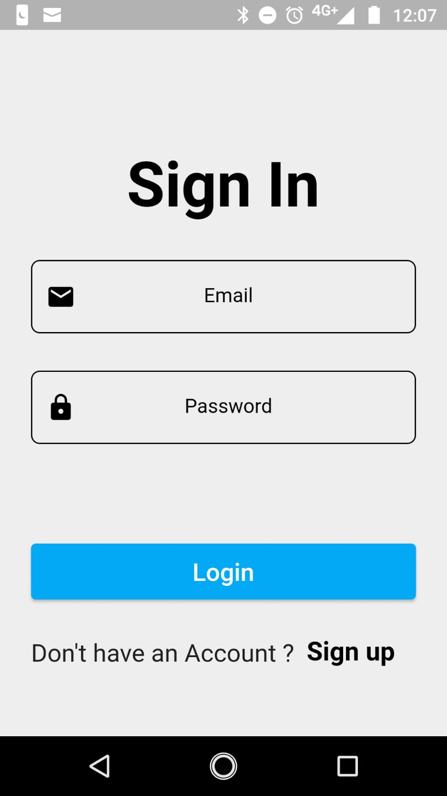
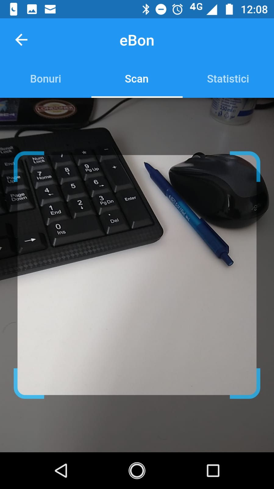
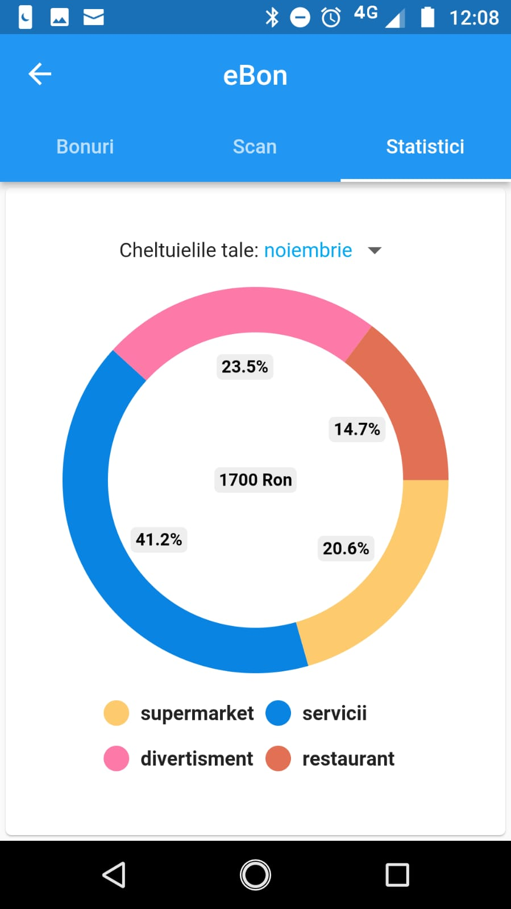
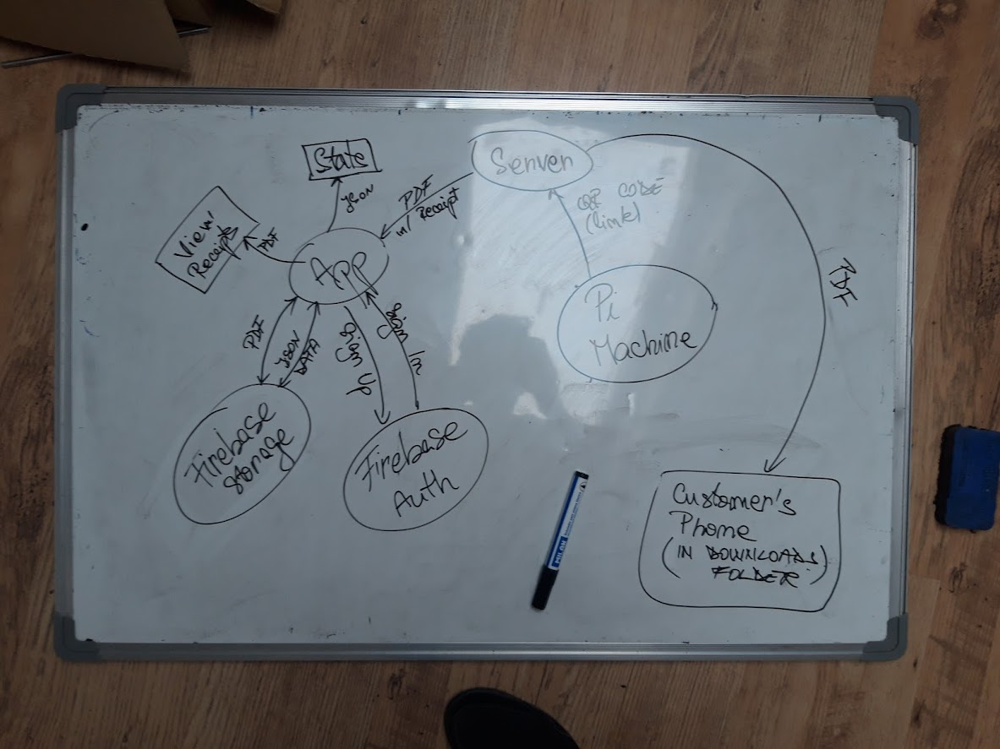

# eBon

eBon represents the digital portal of all the receipts that we are using during our everyday life. 
Our main aim is to digitalize receipts, to offer customers a more technological experience in the stores and to help the environment during the process.

## Features
Our project is divided into 2 main categories:
  - *software* 
  - *hardware*

In terms of software, we built a **Flutter application** (which is available for Android / iOS / Web). 

And in terms of hardware, we used a **Raspberry Pi 4 (4GB RAM)** with a mobile phone that is used as a display for the Raspberry Pi. 

#### Status quo 
At this moment, during the UniHack 2021 weekend, we were able to create this app for the Romanian stores market. What does this mean ? 

Basically our project can be implemented just in Romania Right now. 

If this project is able to survive, we really believe that if we are able to gather more stores from all over the world, eBon can be implemented anywhere.

#### Integration
eBon has a quick integration in the infrastructure of stores (it's very easy to 'plug and play') and it does not require a lot from the customers. 

The general checkout system can look like this:

#### The choice
eBon still offers the customers the posibily to receive clasic receipts. The customer has always the choice between classic receipts or the digital form of them.

What is cool about eBon is that even if a person does not have our app installed, he/she can still scan the QR code and download the receipt as PDF file. 

We belive that we will not be able to eliminate all those physical recipts, but we belive that eBon can help a lot in this situation.

## Behind eBon

### Hardware 
We realised that integrating eBon as a useful solution for the market requires an efficient and affordable way.

Instead of building our own checkout, we wanted to create a device that can work exactly as a thermal printer, so this is where eBox comes to our attention.

eBox is basically a Raspberry Pi 4 (4 GB RAM) connected to a phone that is used as a display via VNC Viewer.  

##### ***The 3D printing story***
We wanted to do the eBox as beautiful as we can. We developed a 3D model for the eBox case, but unfortunately we were not able to print all the pieces that we needed. 

Here's a look how our case should have looked like:

     
You can take a look [here](3D-models) to see more pictures and the 3D files.

So without our 3D printed piece we were not able to do the eBox as we wanted to be, but we improvised as good as we could.

### Software
On the software side, we developed a Flutter app and some scripts that represent the key to a secured infrastructure for eBon. 

#### ***Flutter app***
This app represent the way the user interacts directly with our project. This is the place where you can add very easily your receipts to our platform and the place where you can see all your receipts and all your expenses.

Images 1                   |  Images 2
:-------------------------:|:-------------------------:
    |  
 

#### ***The eBon ecosystem***

#### ***The Raspberry Pi code***
This part of the code is used mainly to generate the QR code, to show it on the display and to process the receipt that will be transmited to our Firebase database.

The Raspberry Pi is connected to the same network as the phone is. It has a static IP. Most of the Raspberry Pi files are written in Python.

> Initially, we wanted to use a dedicated 7inch display for the Pi, but unfortunately, we were not able to find a functionable display.
> Also, we wanted to use a NFC reader, but again, unfortunately the model that we had was not compatible with the phone's NFC chip.

#### ***How does our network work ?***
There are more steps that are essential for our project to work. Let's take a look : 
     
     1. the Raspberry Pi receives its data via USB from a computer
          - the data that we are talking about is reffered to 
          - this is the place where eBon all process
     
     2. our highschool's private server receives the files (for a short period of time)
          - the file is stored there for a short period of time
          - then it is transfered to our Firebase database 
          - whem the transfer is done, the file will autodelete from our highschool's private server   
     
     3. the data, sent by the Raspberry Pi, will arrive in our Firebase

### Production cost 
In the circumstances where we had a good 7inch LCD display for the RaspberryPi, the 3D pieces that we needed and maybe a Raspberry Pi Zero, we believe that the production price of one eBox can be around 115$ for one eBox that is equiped with all the code and accesories that are needed.

### The impact in the real world
We really belive that our product can bring a change in the way the markets work. We live in a society where everything around us is digitalized : our TV invoices, our personal documents and 

eBon can really bring a difference in someone's life with the way the platform was thought. It is easy to use for all the customers and 'plug and play' for all the commercians that want to integrate our solution in their business. 

## About us 
This project was developed during **UniHack 2021**. All of this was created created by 3 highschool studens from the *"Grigore Moisil" Highschool* from Timisoara, Romania:
- Mihai Albu, 12th grade
- Sirbu Andrei, 12th grade
- Vlad Tomici, 10th grade

During this weekend we were able to understand each other's workflow, to share some good memories and to just complain about how dumb is a programming lanuage or framework. But the most important thing is that we were able to finish this project. And even if it is not completely done, we believe that we were able to do a great job.
